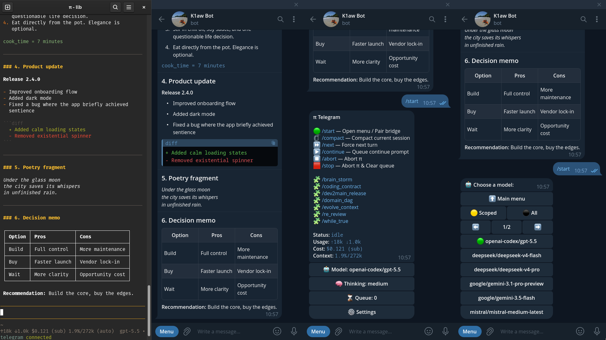

# pi-telegram



Better Telegram DM bridge for pi.

This repository is an actively maintained fork of [`badlogic/pi-telegram`](https://github.com/badlogic/pi-telegram). It started from upstream commit [`cb34008460b6c1ca036d92322f69d87f626be0fc`](https://github.com/badlogic/pi-telegram/commit/cb34008460b6c1ca036d92322f69d87f626be0fc) and has since diverged substantially.

## Start Here

- [Project Context](./AGENTS.md)
- [Open Backlog](./BACKLOG.md)
- [Changelog](./CHANGELOG.md)
- [Documentation](./docs/README.md)

## Key Features

- **Priority Command Queue**: Control commands such as `/status` and `/model` use a high-priority control queue, so they do not get stuck behind normal queued prompts when pi is busy.
- **Interactive UI**: Manage your session directly from Telegram. Inline buttons allow you to switch models and adjust reasoning (thinking) levels on the fly.
- **In-flight Model Switching**: Change the active model mid-generation. The agent gracefully pauses, applies the new model, and restarts its response without losing context.
- **Smart Message Queue**: Messages sent while the agent is busy are queued and previewed in the pi status bar, and queued turns can be reprioritized or removed with Telegram reactions.
- **Mobile-Optimized Rendering**: Tables and lists are formatted for narrow screens. Markdown is correctly parsed and split to fit Telegram's limits without breaking HTML structures or code blocks.
- **File Handling & Attachments**: Send images and files to the agent, or ask it to generate and return artifacts. Outbound files are delivered automatically via the `telegram_attach` tool.
- **Streaming Responses**: Smooth, real-time typing effect using Telegram Drafts (or message edits as a fallback).

## Install

From npm:

```bash
pi install npm:@llblab/pi-telegram
```

From git:

```bash
pi install git:github.com/llblab/pi-telegram
```

## Configure

### 1. Telegram Bot

1. Open [@BotFather](https://t.me/BotFather)
2. Run `/newbot`
3. Pick a name and username
4. Copy the bot token

### 2. Connect to pi

Start pi, then run:

```bash
/telegram-setup
```

Paste your bot token when prompted. If a bot token is already saved in `~/.pi/agent/telegram.json`, `/telegram-setup` shows that stored value by default. Otherwise it prefills from the first configured environment variable in `TELEGRAM_BOT_TOKEN`, `TELEGRAM_BOT_KEY`, `TELEGRAM_TOKEN`, or `TELEGRAM_KEY`.

Link the bridge to your current pi session:

```bash
/telegram-connect
```

_(Note: The bridge is session-local. Only one pi session can be connected to the bot at a time.)_

### 3. Pair your account

1. Open the DM with your bot in Telegram
2. Send `/start`

The first user to message the bot becomes the exclusive owner of the bridge. The extension will only accept messages from this user.

## Usage

Once paired, simply chat with your bot in Telegram. All text, images, and files are forwarded to pi.

### Commands & Controls

- **`/status`**: View session stats, cost, and use inline buttons to change models.
- **`/model`**: Open the interactive model selector.
- **`/compact`**: Start session compaction (only works when the session is idle).
- **`/stop`**: Abort the active run.
- **`/telegram-disconnect`** (in pi): Stop polling in the current session.
- **`/telegram-status`** (in pi): Check bridge status.

### Queue, Reactions, and Media

- If you send more Telegram messages while pi is busy, they are queued and processed in order.
- `👍` moves a waiting turn into the priority block. Removing `👍` sends it back to its normal queue position, and adding `👍` again gives it a fresh priority position.
- `👎` removes a waiting turn from the queue. Telegram Bot API does not expose ordinary DM message-deletion events through the polling path used here, so queue removal is bound to the dislike reaction.
- For media groups, a reaction on any message in the group applies to the whole queued turn.
- Inbound images, albums, and files are downloaded to `~/.pi/agent/tmp/telegram`, local file paths are included in the prompt, and inbound images are forwarded to pi as image inputs.
- Queue reactions depend on Telegram delivering `message_reaction` updates for your bot and chat type.

### Requesting Files

If you ask pi for a file or generated artifact (e.g., _"generate a shell script and attach it"_), pi will call the `telegram_attach` tool, and the extension will send the file alongside its next Telegram reply.

Examples:

- `summarize this image`
- `generate a shell script and attach it`

## Streaming

The extension streams assistant text previews back to Telegram while pi is generating.

It tries Telegram draft streaming first with `sendMessageDraft`. If that is not supported for your bot, it falls back to `sendMessage` plus `editMessageText`.

## Notes

- Only one pi session should be connected to the bot at a time
- Replies are sent as normal Telegram messages, not quote-replies
- Long replies are split below Telegram's 4096 character limit
- Outbound files are sent via `telegram_attach`

## License

MIT
